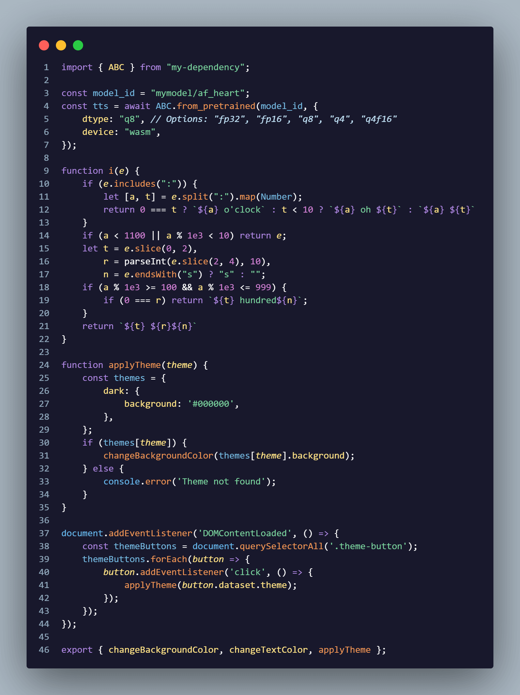
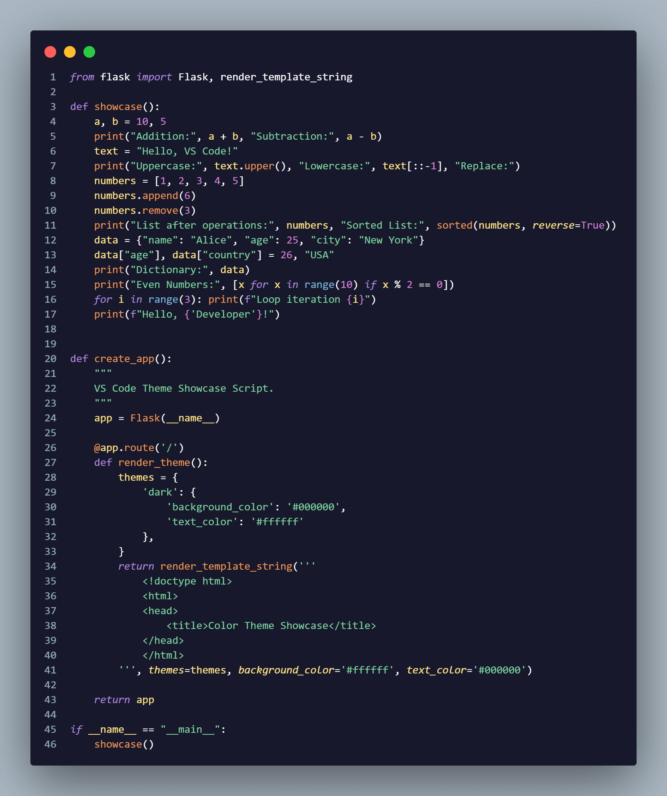
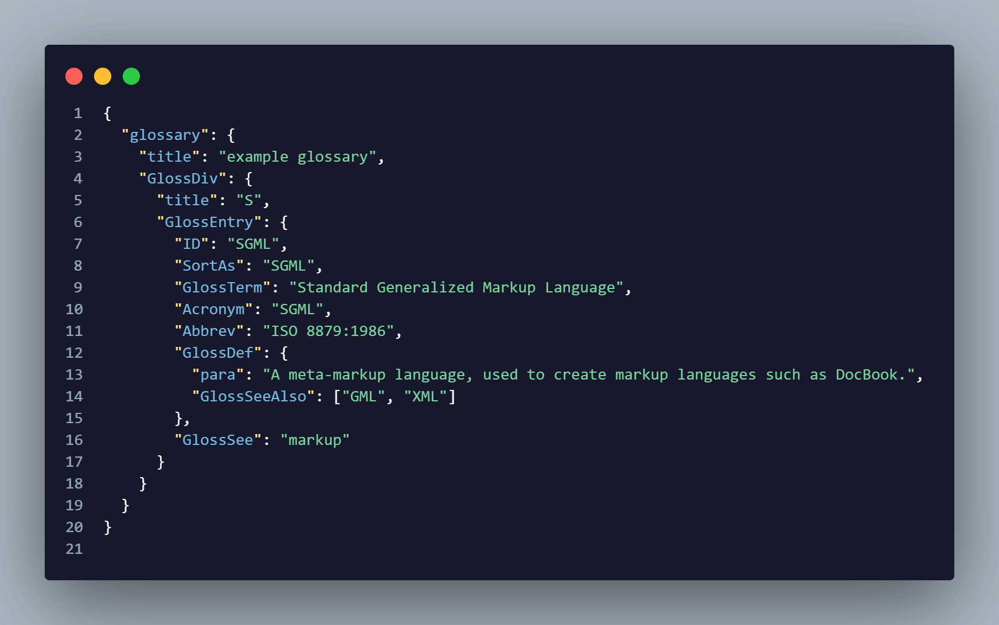
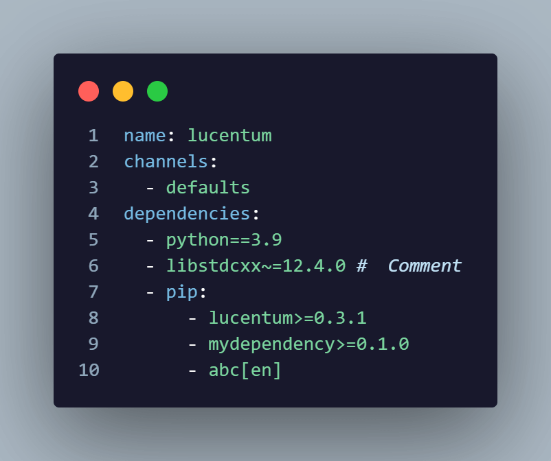

# ⚝ Lucentum Theme for VS Code

A sleek and modern dark theme for [Visual Studio Code](http://code.visualstudio.com), designed to enhance your coding experience.

Dark and minimalistic design for better focus and reduced eye strain.
Language-specific syntax highlighting for JavaScript, Python, JSON, YAML, and more.
Customizable to suit your preferences.

Here are some previews of the Lucentum Theme in action:

## 🚀 Installation

1. Open **Visual Studio Code**.
2. Go to the **Extensions View** by clicking on the Extensions icon in the Activity Bar on the side of the window.
3. Search for `Lucentum Theme`.
4. Click **Install** to add the theme to your editor.
5. Go to **File > Preferences > Color Theme** and select `Lucentum Theme`.

Contributions are welcome! If you'd like to improve this theme, feel free to open a pull request.
If you enjoy using the Lucentum Theme, consider giving this repository a ⭐ on GitHub to show your support!

Enjoy ❤️

